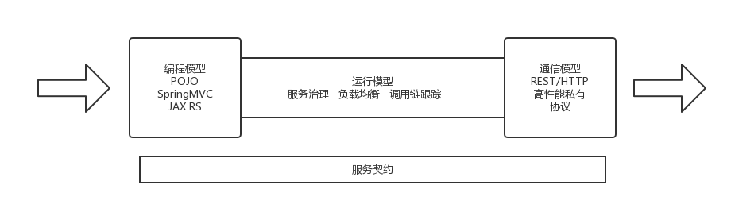
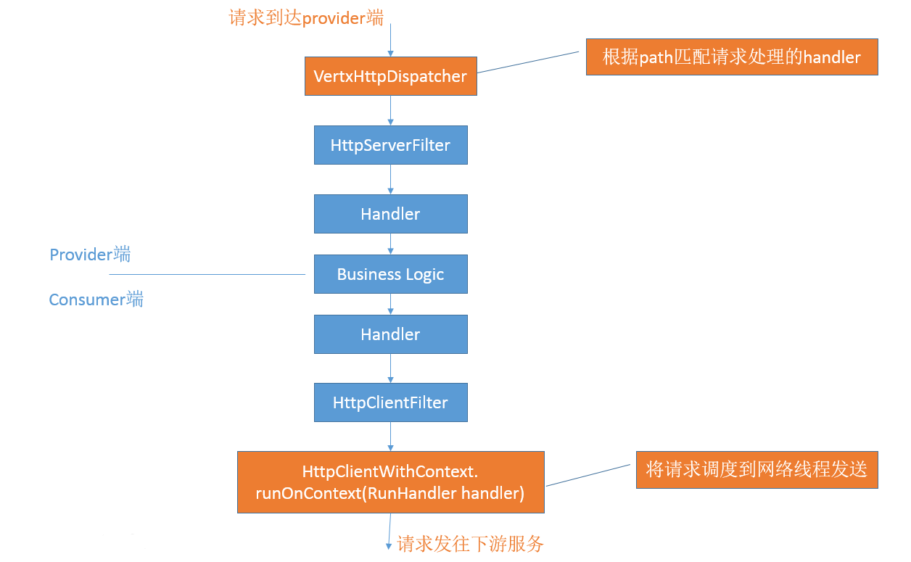

<link rel="stylesheet" type="text/css" href="css/auto-number-title.css" />

# CSEJavaSDK基本使用知识

## CSEJavaSDK简介

### 与ServiceComb的关系

[ServiceComb-Java-Chassis][Java-Chassis代码库]，简单来说就是一个华为开源的Java微服务开发框架，现已进入Apache。 [CSEJavaSDK][CSEJavaSDK华为云官网文档]是它的商业版本，在Java-Chassis的基础上扩展了一些商用版本的功能，例如对接华为云的认证模块。由于华为已经将CSEJavaSDK的大部分内容开源出去了，所以使用CSEJavaSDK开发微服务和使用ServiceComb开发时实际引入的依赖jar包大部分是相同的。

从maven依赖的角度看，包名为`org.apache.servicecomb`的包是开源SDK的包，包名为`com.huawei.paas.cse`的包是商业SDK的。

### maven依赖配置

为了方便使用，CSEJavaSDK中加入了一些用于依赖管理的包，可以让用户在开发微服务时减少配置工作量。推荐的pom配置如下：
1. 在pom文件中引入`dependencyManagement`

  ```xml
  <properties>
    <cse.version>2.3.47</cse.version>
  </properties>

  <dependencyManagement>
    <dependencies>
      <dependency>
        <groupId>com.huawei.paas.cse</groupId>
        <artifactId>cse-dependency</artifactId>
        <version>${cse.version}</version>
        <type>pom</type>
        <scope>import</scope>
      </dependency>
    </dependencies>
  </dependencyManagement>
  ```

  这个文件管理了CSEJavaSDK（以及ServiceComb-Java-Chassis）的所有模块，升级CSEJavaSDK版本时只需要修改`cse.version`属性值即可。如果是多模块项目，推荐将这部分配在根pom文件中。

2. 引入CSEJavaSDK的开发包

  ```xml
  <dependencies>
    <dependency>
      <groupId>com.huawei.paas.cse</groupId>
      <artifactId>cse-solution-service-engine</artifactId>
    </dependency>
  </dependencies>
  ```

  如果之前你使用ServiceComb开发过微服务，那么你应该需要引入多个ServiceComb开发所需的核心包，还需要根据你的[编程模型、通信模型][ServiceComb-Java-Chassis微服务系统架构]的不同而选择性引入一些不同的包。而使用CSEJavaSDK，只需引入`cse-solution-service-engine`包就可以涵盖大部分常用的SDK依赖。

  > - `cse-solution-service-engine`包引入了常用的SDK依赖包，但这又不可避免地会造成依赖的冗余，毕竟一键式配置的便利性与项目的依赖冗余度难以两全。用户如果对这方面有较高要求的话，可以不使用这个包，而是精确地引用自己所需的依赖。
  > - `cse-solution-service-engine`包不仅提供了常用依赖，还提供了一部分默认配置，包括默认的handler配置、域名解析配置等。想要了解这部分内容的话，你可以解压开`cse-solution-service-engine`的jar包，查看其中的`microservice.yaml`文件。

## 接口定义及契约生成

### ServiceComb-Java-Chassis中的契约



这是从ServiceComb开源资料[ServiceComb-Java-Chassis微服务系统架构][ServiceComb-Java-Chassis微服务系统架构]中拿到的一张图。可以看到，服务契约的作用贯穿ServiceComb的三个模型，而不是简单地作为接口文档。这样设计的好处，简单地说，就是可以将三个模型解耦合，因为在它们交互的地方，服务契约定义了统一的数据和行为。这样无论用户使用的是SpringMVC开发模式、JAX-RS开发模式还是POJO开发模式，他们所使用的治理模块、通信模块都是统一的。诚然，契约的存在给了ServiceComb框架的开发者和使用者一定的限制，接口定义和参数传递没有传统的Servlet开发风格下那么随心所欲了，但是换来的优势是很明显的，尤其是在微服务系统的规模上升的时候。契约文件不仅仅是清晰地描述了接口如何调用，让开发和测试之间的协作更方便，而且令运行模型和通信模型的开发工作量减少。  
举个例子，无论是使用SpringMVC还是JAX-RS开发服务，灰度发布功能都是由同一个依赖模块提供的，无需切换。而用户自定义扩展功能时，也不用考虑编程模型的问题。如果想要从REST通信模式改为使用highway通信模式，只需要引入highway的依赖包，然后在microservice.yaml文件中配置上highway监听的IP端口就好了，无需修改业务代码。

### 接口定义

关于使用[SpringMVC模式][用SpringMVC开发微服务]、[JAX-RS模式][用JAX-RS开发微服务]、[POJO模式][用透明RPC开发微服务]的具体方法，大家可以参考ServiceComb的开源文档。SpringMVC模式和JAX-RS模式的使用方式大体上和原生的一致，需要注意的是某些注解的作用会有变化，比如`@RequestParam`变成了仅从query中获取参数。如果碰到有些参数描述不好在SpringMVC、JAX-RS的原生注解中做的，可以[使用Swagger注解][使用Swagger注解]。

在定义REST服务接口的时候，需要遵守一个原则，即服务接口能够被服务契约明确地描述出来。如果你觉得自己写的接口中有个方法的参数表无法明确地用契约描述，那么这种用法基本上就是不被ServiceComb支持的。例如，返回值类型是抽象类、使用一个Map来接收所有的query参数。
> 抽象的返回值类型即使在provider端能够被序列化，在consumer端将其反序列时也会因为框架不知道该转换为何种具体类型而出问题；而使用Map来接收query参数，也会因为query参数信息的缺失而给中间的运行模型实现带来麻烦。因此，这些特性当前都是不支持的。
>
> 建议阅读“[接口定义和数据类型][接口定义和数据类型]”以了解更多说明。
>
> 对象类型参数和返回值建议使用标准的JavaBean类型定义，以避免潜在的参数传递问题。

### 契约的来源

对于ServiceComb框架，其使用的契约可以[从用户自行书写的契约文件中加载][手工定义服务契约]，也可以[扫描REST服务接口类自动生成][CodeFirst模式]。其中手工定义服务契约的优先级高于框架自动生成契约。

推荐的服务接口开发模式是使用SpringMVC或JAX-RS模式，搭配CodeFirst模式，这样定义和修改接口都比较方便，也不会像POJO模式那样由于缺少注解信息而需要将所有方法包装成POST请求。

## 服务注册

每个微服务实例在启动的时候都会将自己的微服务信息、实例信息注册到服务中心。

### 注册微服务信息

首先注册的是微服务信息，`MicroserviceRegisterTask`会首先根据appId、serviceName、version、env这几个参数去服务中心查询微服务记录是否存在，如果存在，SDK就会直接将查到的serviceId保存下来；如果不存在，SDK会将微服务记录注册到sc上，包含appId、serviceName、version、schema名称、env这几个信息，并将sc返回的serviceId保存。  
接着还需要注册契约的内容。SDK会去sc批量查询微服务中包含的所有契约的名称及其对应的hash值，并跟本地契约进行比对（为了保证旧版本的兼容性，如果hash值不存在，则会直接从sc拉取契约内容进行比对）。如果出现契约不一致的情况（本地契约多了、少了、内容改变）：
- 当env设置为开发态时（配置项`service_description.environment`=`development`），SDK会将内容不一致的契约和本地多出来的契约注册上去，而sc中多出来的契约则不会删除（但会有告警日志）；
- 当env为其他值时，会直接报错，在日志中打印sc和本地契约信息不一致的错误日志，以避免生产环境因微服务集群中混入了接口不一致的微服务实例而导致的难以定位的错误。
> 需要注意的是，虽然开发态支持provider端修改接口后直接重启并更新契约到sc，但是consumer端只会在初次调用该微服务记录的实例时加载一次契约，后续不会更新，因此调试过程中一旦修改REST服务接口，需将provider端、consumer端实例都重启一次。

### 注册实例信息

微服务信息注册成功后，会接着运行微服务实例的注册任务`MicroserviceInstanceRegisterTask`，将该实例的endpoint信息、心跳时间间隔、最大心跳失败次数注册到服务中心上去。

实例的endpoint信息就是该实例发布到sc的，供其他微服务调用的地址。一个实例可以有多个endpoint，例如如果实例同时启用了REST传输方式和highway传输方式，那么它就会注册两个endpoint到sc。需要注意：一个实例的监听地址和它发布到sc的endpoint（发布地址）不是等同的，一般开发时配置的`servicecomb.rest.address`和`servicecomb.highway.address`是监听地址，SDK会自动根据监听地址推断发布地址。但是某些SDK推断机制达不到要求的情况下，就需要开发者自行制定发布地址了，详见[服务监听地址和发布地址][服务监听地址和发布地址]。

心跳时间间隔和最大心跳失败次数会影响sc判断实例下线的行为。当sc在`心跳时间间隔*(最大心跳失败次数+1)`长的时间段内都没有收到实例心跳请求，则会认为该实例已经意外关闭，会将实例下线。相关配置见[访问服务中心][访问服务中心]。这个参数可以进行调整以满足特定场景，但是需要注意，这两个参数调得太大会导致sc不能及时感知实例异常下线的情况；调得太小会加重网络负载，并且在某些通过APIGateway或LB访问sc的场景下还会因触发限流而导致频繁的心跳失败，容易让实例被sc误下线。

### 实例注销（优雅停机）

正常情况下微服务实例退出时，JVM会触发SDK注册的shutdown hook，执行一系列清理操作并且向sc发送注销实例的请求，使得该实例可以及时下线。  
由于JVM的限制，shutdown hook只能在正常关闭进程时触发，如果是强制杀进程（`kill -9`），则shutdown hook不会被触发，只能由sc感知心跳超时来下线实例。

## 微服务调用

微服务的调用方式分为[RestTemplate调用][RestTemplate调用]和[RPC调用][RPC调用]两种开发方式。用户可以自行选择喜欢的方式开发调用代码。

服务调用方并不是在刚启动的时候就去sc查询自己所调用的服务的信息，而是采用懒加载机制，等到调用第一次发生时，再从服务中心拉取微服务的契约信息和实例信息。特定服务的特定版本的契约只会加载一次，而实例信息会在后续由一个定时调度线程池定期刷新。

SDK中跟调用相关的治理能力基本都是在consumer端handler链里面做的，包括熔断容错、负载均衡等。使用这些能力并不需要用户在调用代码里增加额外的逻辑。当provider端有多个实例时，实例的选取逻辑主要是在负载均衡模块做的，不需要用户显式指定调用特定的实例。（当前版本用户也做不了指定，这个在微服务多实例部署的场景下没有什么意义）

> 服务调用时有一些问题需要注意：
> - 由于ServiceComb提供的RestTemplate是扩展自Spring的RestTemplate，并且保留了Spring原生的调用机制。有时候会见到用户在使用的ServiceComb的RestTemplate做调用时，url写的却是“http://{ip}:{port}/path”这样的。使用这种url也可以将请求发送出去，但是走的却是Spring原生的机制，ServiceComb的各种治理机制、通信模块都没有生效。由于调用也能通过，有时候这种失误在本地开发、调试的时候不容易被察觉。正确的url应该是“cse://{microserviceName}/path”这样的。注意url的scheme的区别。
> - ServiceComb的consumer端和provider端是解耦合的，也就是说只要调用方式和服务契约对得上，ServiceComb不限制用户使用何种方式开发、何种线程模式运行consumer和provider。换言之，provider端可以是用JAX-RS模式开发，工作于同步模式；consumer端使用RestTemplate模式调用，工作于[Reactive模式][Reactive模式]，这样是完全能够调通的。
> - 推荐用户在编写调用方代码时将对象类型的参数名称设置为跟契约描述的完全一致。举个例子，如果某provider接口返回一个对象类型`com.xxx.yyy.OprResponse`，那么consumer端用于RPC调用的代理接口、或RestTemplate调用代码里指定的返回值类型最好也是`com.xxx.yyy.OprResponse`，即返回对象的类名、包名完全一致。因为这样可以让Java认为反序列话得到的Java对象类型和调用端业务代码用于接收返回值的类型一致，从而减少一次Java类型转换过程，提高调用性能。

## 配置加载和动态刷新

### 日志配置

在这里先提一下日志的配置。ServiceComb直接依赖的是slf4j的日志打印接口，默认使用的日志打印实现是Log4j，配置文件是property文件。  
ServiceComb读取的日志文件名为`log4j.*.properties`，从classpath下的config/base/目录或config/目录中读取。
> ServiceComb会从微服务项目还有SDK自身jar包里加载日志配置文件，按优先级高低将其合并为一份生效的配置。如果优先级最高的一份配置文件所在的目录可写（通常这是用户放了一份日志配置在某个磁盘目录中），则ServiceComb会将合并后的日志配置输出到这个目录，名字是`merged.log4j.properties`，便于排查日志问题。  
> 如果目录不可写，会打印一行错误日志，但出现这个信息日志系统也是能正常工作的：  
> Can not output merged.log4j.properties,because can not write to directory of file ...

### 配置文件加载

ServiceComb使用的配置文件是microservice.yaml文件，从classpath下读取。ServiceComb会将磁盘中的配置文件作为高优先级文件，覆盖jar包内的配置。配置文件的优先级是可以设置的，通过在配置文件中设置`servicecomb-config-order`，可以指定配置的优先级，数值大的优先级高。  
例如，java-chassis-core包中就有一份默认的配置文件，将优先级设置得较低，方便用户覆盖配置：
```yaml
servicecomb-config-order: -500
```
> 我们比较推荐用户在打jar包的时候将"."目录打进classpath，这样可以直接放一份microservice.yaml文件到服务jar包所在目录来覆盖jar包内的配置，方便运维和问题定位。

ServiceComb也支持其他的配置途径，按优先级从高到低来说：
动态配置 > System property > 环境变量 > 从Spring获取的配置 > microservice.yaml文件

> - System property 通过-Dxxx=yyy配置
> - 从Spring获取配置是为了方便SpringBoot和SpringCloud的开发者将他们的服务接入到ServiceComb，这样做可以沿用之前的application.properties配置。但是读取application.properties配置的一系列功能是SpringBoot具备的，Spring框架本身没有。所以用户使用原生的ServiceComb（或CSEJavaSDK）开发时，不能使用appilcation.properties配置。当从Spring框架拿到了配置时，会打印一行`Environment received, will get configurations from ...`的日志。
> - SDK会将读取到的microservice.yaml文件位置打在日志里，方便定位问题，如：
```
[INFO] create local config: org.apache.servicecomb.config.ConfigUtil.createLocalConfig(ConfigUtil.java:114)
[INFO]  jar:file:/D:/.m2/repository/org/apache/servicecomb/java-chassis-core/1.1.0.B011/java-chassis-core-1.1.0.B011.jar!/microservice.yaml. org.apache.servicecomb.config.ConfigUtil.createLocalConfig(ConfigUtil.java:116)
[INFO]  jar:file:/D:/.m2/repository/com/huawei/paas/cse/cse-solution-service-engine/2.3.39/cse-solution-service-engine-2.3.39.jar!/microservice.yaml. org.apache.servicecomb.config.ConfigUtil.createLocalConfig(ConfigUtil.java:116)
[INFO]  file:/D:/IdeaProjects/ServiceCombDemo/CSEAccountAuthExample/account-service/target/classes/microservice.yaml. org.apache.servicecomb.config.ConfigUtil.createLocalConfig(ConfigUtil.java:116)
```

### 动态配置

配置加载处于ServiceComb启动流程中靠前的位置，如果从本地配置中读到了配置中心的地址，那么还会立即从配置中心读取一次动态配置，再进行后续的启动流程。即使这次读取配置中心的配置失败了，启动流程也会继续进行下去。启动完成后，会有定时任务定时从cc读取配置。

连接配置中心的客户端是通过SPI加载机制加载的，只要引入了对应的依赖就可以加载配置中心客户端。如果没有可用的cc客户端，会打印提示日志`config center SPI service can not find, skip to load configuration from config center`；而如果加载了cc客户端，却找不到对应的cc地址配置，会打印`Config Source serverUri is not correctly configured.`。

ServiceComb使用Netflix的Archaius来管理全部的配置。无论配置的来源是cc、环境变量、还是配置文件，都可以使用Archaius提供的API来使用配置。

cc连接的配置以及配置信息的使用可以参考文档[动态配置][动态配置]。

## 线程模型、reactive

ServiceComb是基于Vert.x开发的。Vertx是一个依赖Netty，具有异步非阻塞特点的框架，它是ServiceComb高性能的基础，但也让ServiceComb的线程模型看上去与传统的服务框架有所不同。ServiceComb线程模型的开源文档在[这里][线程模型]，使用ServiceComb原生的默认开发方式时，其传输方式为[Rest over Vertx][RestOverVertx]传输方式。

### RestOverVertx传输方式、同步工作模式下的线程模型

> 对于ServiceComb的入门使用者来说，判断一个微服务provider是不是工作于同步模式，只需要看它的所有REST服务接口是否都是直接返回应答对象类型就可以了。如果有CompletableFuture类型的返回值，那么一般都是[Reactive模式][Reactive模式]的。

简单来说，ServiceComb的网络线程和连接池是一对一的关系。而对于业务线程而言，当第一次调用发生时，它会绑定到特定的一个网络线程上，再绑定网络线程内特定的连接，以避免冲突。

服务端方面，当请求到达微服务实例时，首先是网络线程从网络连接中接收到请求，经过一些处理后切换到业务线程运行provider端handler链、HttpServerFilter、用户的业务逻辑。切换到业务线程后，网络线程就可以去处理下一个请求了。这样可以使网络线程一直处于处理请求的状态，**开发者要避免做阻塞网络线程的操作**，如访问数据库、发送REST请求等。

客户端方面，业务线程发送请求时，首先会在业务线程中对请求做一些处理（包括consumer端handler链、HttpClientFilter），然后转移到网络线程中进行发送。在等待应答的过程中，业务线程会一直处于阻塞状态。等到网络线程返回应答后，会通知业务线程继续运行后面的逻辑。

可以看出，同步工作模式下，一个请求大体上有三类线程处理：服务端网络线程、业务线程、客户端网络线程。在请求处理过程中会经历线程切换。两端的网络线程运行于异步非阻塞的状态，可以用较少的线程数处理较多的请求，而业务线程会阻塞等待应答。

因此，如果业务线程处理请求时间较长，请求可能会因为默认的业务线程数不足而进入排队状态。此时可以适当地调整业务线程池来缓解问题。  
但是调大业务线程池容量不是万能的解决办法，这不仅仅是因为系统对线程数量有限制，也因为网络连接数的限制。由于HTTP协议的特性，provider服务实例在接收并处理一个服务请求时，对应的连接是一直处于占用状态的，直到该请求返回应答。（这里说的不是keep-alive，ServiceComb默认就是使用长连接。但是HTTP 1.x协议要求一个长连接上只能等上一个请求的应答返回了再发送下一个请求。）因此，即使业务线程数足够大了，也有可能因为网络连接数的不足而导致请求处理失败。

> Tips: ServiceComb支持operation粒度的业务线程池配置。用户可以自定义业务线程池。

### RestOverVertx传输方式、Reactive模式下的线程模型

> 关于Reactive模式的前因后果，建议直接了解一下Netty和Vertx。

[Reactive模式][Reactive模式]，简单地说是将所有的处理逻辑都运行在网络线程中，当一个请求到达服务端接口时，会触发网络线程运行provider端handler链、HttpServerFilter、业务代码的逻辑。如果业务逻辑中有对其他服务的调用，则也应该采用Reactive调用方式，以避免等待应答时阻塞网络线程。当调用的应答返回业务逻辑代码时，再触发网络线程继续运行接下来的逻辑。

换言之，Reactive模式下，所有逻辑都是由网络请求、应答来驱动网络线程执行的。代码逻辑跑到需要等待结果的地方时，线程就直接运行完成，去处理别的请求了，等这个结果返回之后，网络线程再回来执行后续的处理逻辑。这样做的好处是没有线程处于阻塞等待的状态，CPU时间得以更充分地利用，线程上下文切换的次数也为零，因而能以较少的线程达到较高的性能。如果说ServiceComb同步工作模式是将高性能的Vertx框架包装成了一般开发人员所习惯的同步模式，令开发人员既享受到同步代码风格开发的便利，又享受到异步非阻塞的性能，那么Reactive模式相当于将Vertx框架的高性能特性发挥得更加彻底，中间损耗更少。

Reactive在性能方面有着巨大的优势，但是却并非完美无缺的。它最大的问题就是要求整个项目的代码都运行于异步非阻塞的状态。一旦有一些第三方系统只有同步接口，比如某些数据库驱动三方件，那么这些地方的调用就不能直接放在业务逻辑中，否则会造成网络线程阻塞，性能打折扣。而即使使用线程池将其隔离，也会因为线程上下文的切换而带来额外开销。同时，异步风格的代码有违一般开发人员的习惯，写出来的代码可能不如传统的同步风格代码那么容易理解、调试和定位问题。

因此，是否使用Reactive模式进行开发，需要设计和开发人员结合实际情况进行取舍。

> PS：
> - 默认情况下的[EdgeService][EdgeService]工作于Reactive模式，因为EdgeService几乎没有用户编写业务代码。当在EdgeService上开发扩展模块的时候，要注意避免阻塞网络线程。
> - 由于前文说到的业务线程池可以自行配置，所以通过REST接口返回类型是否是`CompletableFuture`来判断是否是Reactive的方法只能涵盖一般情况。最直接的方法是调试的时候在自己的业务代码里面打断点看一下线程的名字，像"pool-3-thread-3"这种名字的线程是业务线程，说明是同步工作模式；"transport-vert.x-eventloop-thread-4"这种名字是网络线程，说明是Reactive模式。

## Metrics和性能测试

### Metrics

ServiceComb提供了默认的性能统计模块，[Metrics][Metrics]。启用方法非常简单，在maven项目里引入`metrics-core`就可以了：
```xml
<dependency>
  <groupId>org.apache.servicecomb</groupId>
  <artifactId>metrics-core</artifactId>
</dependency>
```
相关配置项请参看开源文档。

使用Metrics模块可以查看丰富的性能数据，可以用于压测、性能对比等。

### 性能测试

性能测试和调优涉及到的内容相当多，这里只做一些最简单的说明。

性能测试的结果受硬件规格的影响，只有综合讨论硬件条件、时延和tps才有意义。当tps达到性能瓶颈后，继续加压只会让时延上升；而tps不会继续上升，甚至还有可能下降。测试性能的时候，应该先限定能接受的时延，比如平均时延3ms，以此为限定条件来加压使tps上升至瓶颈处，观察硬件资源的消耗情况。如果tps达到瓶颈时，CPU和带宽占用率已经很高了，那么可以认为在此硬件条件下的性能上限就是这么多。在tps达到瓶颈而硬件资源还有较多剩余时，分析性能问题才有意义。

作为参考，我们框架自带的性能测试代码在这里： https://github.com/apache/incubator-servicecomb-java-chassis/tree/master/demo/perf

进行性能对比的时候，可以考虑将ServiceComb框架和其他框架运行在同一硬件环境中，结合资源的消耗情况分析对比。

-----------------------------------------------------------

# 扩展机制

> ServiceComb提供了较多的扩展机制，供用户实现特定业务场景下的功能。这里介绍几种比较重要或常用的，扩展机制的说明都可以在[ServiceComb文档][ServiceComb文档]里面找到。

## Handler机制



上图展示了一次请求被微服务实例处理，并且调用下游系统的处理流程。在同步工作模式下，橙色部分运行于网络线程，蓝色部分运行于业务线程。

可以看到，provider端和consumer端的handler链包裹住了业务处理逻辑。ServiceComb中的大部分治理能力都是由Handler机制实现的。

### 接口简述

```java
public interface Handler {
  default void init(MicroserviceMeta microserviceMeta, InvocationType invocationType) {
  }

  void handle(Invocation invocation, AsyncResponse asyncResp) throws Exception;
}
```

上面是Handler接口的定义，需要关注的是其handle方法。其中的Invocation参数中携带了本次调用相关的信息（每次请求都对应生成了一个Invocation对象来表示）；AsyncResponse则是一个函数式接口，方便开发者定义处理返回结果的回调函数，并且包装了几个常用的发送返回值的方法。

### 开发Handler处理逻辑

如果你不知道该怎么开发一个Handler的话，除了参照ServiceComb的demo，也可以参考ServiceComb提供的默认handler。当前最适合做例子的应该是用于限流的Handler了。[ServiceComb文档][HandlerChain]中也有其他Handler的介绍。

```java
@Override
public void handle(Invocation invocation, AsyncResponse asyncResp) throws Exception {
  if (!Config.INSTANCE.isConsumerEnabled()) {
    invocation.next(asyncResp); // 不做处理，将此次调用放行给下一个handler处理
    return;
  }

  QpsController qpsController = qpsControllerMgr.getOrCreate(invocation.getMicroserviceName(), invocation);
  if (qpsController.isLimitNewRequest()) {
    // return http status 429
    CommonExceptionData errorData = new CommonExceptionData("rejected by qps flowcontrol");
    asyncResp.consumerFail( // 错误情形，请求不再往下游走，直接返回错误结果
        new InvocationException(QpsConst.TOO_MANY_REQUESTS_STATUS, errorData));
    return;
  }

  invocation.next(asyncResp); // 处理完成，将此次调用放行给下一个handler处理
}
```
上面是qps-flowcontrol-consumer handler的处理逻辑，从中可以看出开发一个Handler的基本操作如下：
1. 如果不需要处理该请求，或者请求已经处理完毕，需要将该请求放行到后面的处理逻辑，就调用`invocation.next(asyncResp)`让`invocation`接着走后面的handler链。
2. 如果不需要执行后续的处理逻辑，而是要直接返回一个结果，那么应该调用`asyncResp`的`handle(Response response)`方法，返回一个Response。或者调用它的各种包装方法，返回一个成功或失败的结果。

> **注意**：由于Handler链处理逻辑全都是异步调用的，因此写这一部分的处理逻辑时必须保证，无论走哪条逻辑分支都要有回调方法被调用，要么调`invocation.next(asyncResp)`将请求进行下去，要么调`asyncResp.handle(Response response)`立即返回一个结果。否则就会出现请求处理逻辑走到一半就结束，任何结果都不返回的情况。这样会造成一种令人困惑的问题场景，即请求代码走到一半就什么事情都不做了，好像工作已经完成了一样；而调用方还在一直等待结果返回，直到报错。

### 配置和加载Handler

要想自定义的Handler能够正常加载使用，首先需要给出一份Handler配置文件，指明Handler的名字和类型。具体写法可以直接参照ServiceComb开源代码里提供的默认Handler。Handler配置文件的加载逻辑在`HandlerConfigUtils`类的`loadConfig()`方法里，从其中读配置的代码可以看出，它会去classpath下的config目录读取"*.handler.xml"文件。
```java
List<Resource> resList =
    PaaSResourceUtils.getSortedResources("classpath*:config/cse.handler.xml", ".handler.xml");
```

Handler实例是根据配置中的类型信息`new`出来的。Handler链和Handler实例都不是单例的，默认的Handler链和具体配置到某个微服务上的Handler链都是启动时新实例化出来的，链上的Handler实例也是如此。
> 推荐大家去`AbstractHandlerManager.create(String microserviceName)`方法里打个断点调试一下，看看Handler链的初始化逻辑。

> **注意**：ServiceComb提供的Handler中，有一个比较特殊，就是"loadbalance"。因为它是唯一一个一旦缺少就会报错，而且又是需要配置在handler链配置项中的Handler。一般而言，如果你没有显式地配置过consumer端handler链，那么会有默认的配置将loadbalance带上，而一旦你显式地配置了consumer端handler，那么就必须自己把loadbalance带上。否则缺少了loadbalance模块，consumer端发送请求的时候少了选择实例endpoint的过程，等到了客户端发送请求的时候就会报错。SDK会抛出一个异常，错误内容为`Endpoint is empty. Forget to configure "loadbalance" in consumer handler chain?``

## HttpServerFilter/HttpClientFilter机制

### Filter机制简介

Filter在Handler链的外围，它们可以在provider端接收请求后和返回应答前，以及consumer端发送请求前和接收应答后，这四个时间点执行一些逻辑。

实现这两个接口所必须要实现的方法，除了`getOrder()`以外，就是server filter的`Response afterReceiveRequest(Invocation invocation, HttpServletRequestEx requestEx)`和client filter的`Response afterReceiveResponse(Invocation invocation, HttpServletResponseEx responseEx)`。  
参数表中的invocation也就是前文中Handler处理的`invocation`。以provider端为例，对于一次请求，会实例化一个Invocation实例，该实例先经过server filter处理，再经过provider端handler链，consumer端亦然。  
至于另外一个参数`requestEx`/`responseEx`，是ServiceComb模拟出来的一个HttpServletRequest/HttpServletResponse对象。它们在内部实现细节上和真正采用Servlet开发风格的代码所拿到的request/response对象存在不同，不能直接将操作方式照搬过来。

> 有些具有Servlet风格项目开发经验的开发看到filter机制的接口，会直接使用原生的Servlet处理方式写代码，结果发现达不到预期的效果。所以需要大家注意一下，ServiceComb是一个REST风格的微服务开发框架，在参数传递和业务处理上不能照搬Servlet开发方式。

关于filter的触发执行方式，基本上可以看做是将一个有序的filter list进行遍历，调用相应的处理方法，如`afterReceiveRequest()`方法。Filter的方法是有返回值的，如果方法返回了一个Response，那么遍历就会终止，并且直接返回这个Response。如果想要接着执行后续的Filter，就需要在方法里返回`null`。

### Filter机制的配置和加载

Filter机制采用SPI加载机制加载实现类实例，SPI机制是Java提供的一套接口扩展和加载机制。要使自己定义的SPI扩展类能够正常加载启用，需要在项目的resources/META-INF/services目录下建立一个与接口同名的文件，将实现类的类名写进去。例如，如果自定义了一个`com.xxx.yyy.CustomFilter`，实现了HttpServerFilter接口，那么就需要在resources/META-INF/services目录下创建一个名为"org.apache.servicecomb.common.rest.filter.HttpServerFilter"的文件，里面写上"com.xxx.yyy.CustomFilter"。这样启动的时候就会加载CustomFilter了。

## VertxHttpDispatcher机制

VertxHttpDispatcher用于向Vertx的[Router][BasicVert.x-WebConcepts]增加[路由规则][VertxRoute]，并在路由规则下挂载处理请求、异常等的[handler][VertxHandler]。可以说，这里是provider端请求的处理流程中，Vertx逻辑和ServiceComb逻辑的边界。

VertxHttpDispatcher的逻辑运行于网络线程中，在这里自定义扩展时要注意不能阻塞网络线程。

通常情况下，ServiceComb所提供的`VertxRestDispatcher`和`DefaultEdgeDispatcher`已经能够满足普通provider服务和[EdgeService服务][EdgeService]开发的需求。而且VertxHttpDispatcher的实现涉及到ServiceComb较底层逻辑，因此在这里扩展的代码会与ServiceComb的底层实现产生一定程度的耦合，也比较容易出错，所以一般不推荐用户在这个机制上自定义扩展。

VertxHttpDispatcher也是使用SPI机制加载的，并且会根据`getOrder()`方法的返回值排序使用，如果一个REST请求没有被前一个Dispatcher匹配中，就会接着跟下一个Dispatcher的路由规则匹配。ServiceComb提供的Dispatcher中比较特殊的是`VertxRestDispatcher`，因为它的order是`Integer.MAX_VALUE`，不会有Dispatcher排在它的后面了，而且它没有设置路由规则，因此会接下所有请求。

## 启动事件监听机制

ServiceComb框架在服务启动和退出的时候会发布特定的事件，如果需要在服务实例生命周期的特定时间点上做一些处理，可以实现ServiceComb的`BootListener`接口来监听事件。事件类型都定义在`BootListener`接口的`EventType`枚举中，事件的发布逻辑都在`SCBEngine`类中。大家可以在开源代码里搜索一下调用关系看看。

一个典型的应用场景，比如某些服务的实例需要在启动完成后立即做一次调用其他服务的操作，那么就可以监听启动事件，在接收到`AFTER_REGISTRY`事件时进行处理。因为`AFTER_REGISTRY`事件的发布意味着微服务实例已经注册到sc上，整个启动流程已经完成了。

-----------------------------------------------------------

# 常见问题及定位技巧

## CSEJavaSDK中的加载机制

CSEJavaSDK中使用的加载机制主要有三种，分别是SPI加载机制、handler.xml加载机制、Spring Bean加载机制，这三种机制各有特点。

SPI机制只要是扫描到了SPI加载文件就会加载扩展类的实例。这种机制对于扩展类的个数没有要求，无论是加载多个还是一个都加载不到都不会报错，因此当漏加载扩展类类时，要到了微服务实例运行的时候才会出现问题，而且有时候问题表现还不太直观。好在ServiceComb使用的SPI加载工具会在加载扩展类的时候答应日志，只需要查看日志就能够很方便地看出有多少扩展类实际启用了。例如如下日志就说明这个微服务实例加载了三个HttpServerFilter的扩展类:
```
[INFO] Found SPI service org.apache.servicecomb.common.rest.filter.HttpServerFilter, count=3. org.apache.servicecomb.foundation.common.utils.SPIServiceUtils.loadSortedService(SPIServiceUtils.java:76)
[INFO]   0. org.apache.servicecomb.common.rest.filter.inner.ServerRestArgsFilter. org.apache.servicecomb.foundation.common.utils.SPIServiceUtils.loadSortedService(SPIServiceUtils.java:79)
[INFO]   1. com.github.yhs0092.csedemo.edge.auth.SessionToContextFilter. org.apache.servicecomb.foundation.common.utils.SPIServiceUtils.loadSortedService(SPIServiceUtils.java:79)
[INFO]   2. org.apache.servicecomb.common.rest.filter.tracing.TracingFilter. org.apache.servicecomb.foundation.common.utils.SPIServiceUtils.loadSortedService(SPIServiceUtils.java:79)
```

handler.xml加载机制是ServiceComb专门用于Handler加载的，启动过程中扫描到了handler.xml也不一定会加载里面的扩展类，还需要将该扩展类配进handler链才会实例化该扩展类。  
handler.xml文件的加载过程不会打印日志。不过如果是本地调试的话，可以在HandlerConfigUtils类的loadConfig()方法里打断点查看配置文件加载情况。另外，如果在handler链配置上指定了某个handler，但是在配置文件中却找不到它，那么SDK会直接抛出错误`throw new Error("can not find handler :" + handlerId)`。

Spring Bean加载机制是通用的开源加载机制，在此不再赘述，只有三点需要补充说明一下。  
- ServiceComb的Spring Bean配置文件是classpath下的META-INF/spring/*.bean.xml文件（参看ServiceComb的`BeanUtils`类），框架启动的时候，Spring会将其加载的配置文件都打出来，内容为"Loading XML bean definitions from ..."
- 有些开发者问询问为什么他们在自己扩展的Handler等类里面使用`@Autowired`或者`@Inject`标记的属性，在运行时会是`null`。这是因为Handler的加载机制是ServiceComb自己将handler实例"new"出来，不是走Spring Bean加载机制实例化的，因此Spring框架也不会对其做自动注入。碰到这种情况可以考虑使用ServiceComb的`BeanUtils`类提供的`getBean(String name)`方法来手动获取和设置Spring Bean。
- 使用`BeanUtils.getBean(String name)`方法要注意调用的时间点，如果在Spring Bean还未加载完成时调用该方法，有可能会导致NoSuchBeanDefinitionException。另外在Spring Bean实例中建议直接使用Spring的依赖注入机制来初始化属性，不要使用`BeanUtils.getBean(String name)`方法。因为`BeanUtils.getBean(String name)`方法的调用不会被Spring框架纳入Spring Bean加载顺序的考虑范畴，因此也有可能由于Bean加载顺序的混乱而导致NoSuchBeanDefinitionException。

## 契约生成

对于ServiceComb根据REST接口类自动生成契约的场景，ServiceComb的`RestProducers`和`PojoProducers`会过滤Spring加载的Bean，分别将其中打了`@RestSchema`和`@RpcSchema`的Bean记录下来。之后ServiceComb会遍历记录下来的Bean list，逐个生成契约并加载。

`ProducerSchemaFactory`类的`createSchema()`方法实现了契约的加载和生成逻辑，在这里可以看到是先从目录加载契约，找不到文件再去根据接口类生成的。  
生成契约逻辑的入口在`SwaggerGenerator.generate()`方法里。ServiceComb逐个扫描接口类、方法上的注解，将契约信息提取并设置到`Swagger`对象中，这个对象就是表示Swagger契约的数据对象。ServiceComb的契约生成机制中，基本上每个注解都有自己的处理类，例如`@RequestParam`对应的处理类就是`RequestParamAnnotationProcessor`，根据“注解名称.*Processor”的命名规则，基本在ServiceComb源代码里可以搜到所有的处理类。

根据编程模型的不同，一些某编程模型特有的注解处理类会分类保存在三个不同的`SwaggerGeneratorContext`实现类中，SDK启动的时候会先加载可用的SwaggerGeneratorContext，然后`ProducerSchemaFactory`在创建`SwaggerGenerator`以生成契约时，会根据REST接口类上的注解选择一个合适的SwaggerGeneratorContext。由于SwaggerGeneratorContext也是使用SPI机制加载的，因此缺少某个实现类也不会报错。这有可能导致最后生成的接口契约不符合预期。  
举个例子：如果由于某些问题，依赖包中少了swagger-generator-springmvc包，那么框架加载的时候就少了SpringmvcSwaggerGeneratorContext，生成契约的时候无法按照SpringMVC方式生成，只能按照POJO方式处理。生成的契约内容就会和预期的不一致。

> ServiceComb是根据打在REST接口类上的注解来确定使用哪种SwaggerGeneratorContext的。如果有@RequestMapping就使用SpringMVC的，如果有@Path就使用JAX-RS的，都没选中的话默认的是POJO的。

所以契约生成出现问题时可以在上述类中打断点调试一下看看，一般能够基本确定问题。

## 请求接收、发送

前文讲到一次请求被微服务处理的流程时，给出了一张流程示意图，这里面的扩展点也可以看做是请求处理的不同阶段，本地调试时也可以根据这张图打点。
- 对于普通微服务provider而言，可以在`VertxRestDispatcher`的`onRequest(RoutingContext context)`方法上打点观察请求的接收。
- SPI机制会打印加载的Filter，因此如果不清楚Filter在哪里被调用的话可以先在日志里面找到加载的Filter实现类，然后选取一个从中打点，就能从上层调用栈中找到所有的Filter了。
- Handler实际上启用了哪些，这个从日志里面看不出来，不过有两个Handler是必定会启用的，可以在这里面打点切入。它们分别是provider端的`ProducerOperationHandler`和consumer端的`TransportClientHandler`，它们位于两条调用链的末端，相当于两个边界。ProducerOperationHandler处理完成后请求参数就要传递给业务逻辑代码了；TransportClientHandler处理完成后请求参数会过一遍client filter，然后就发送出去了。
- 对于业务代码做请求调用的逻辑入口，RestTemplate可以直接走进去查看，而RPC方式可以在`Invoker`类的`invoke`方法里打个断点，`Invoker`是RPC调用方式的provider调用接口的动态代理，业务代码使用代理接口做调用时请求首先走到了这里。

>  这里只是提了一下几个比较粗略的节点，具体情况还是需要开发者自己调试一下以获得更直观的认识。定位经验多了以后，你会发现其他地方也可以作为常用的调试切入点。

## 与SC/CC的交互

### SC相关的定位入口

与SC相关的问题一般是服务注册、实例注册、心跳、服务发现等。可以去`MicroserviceServiceCenterTask`里面看看它添加了哪些定时任务，这些任务跟服务注册、实例注册、服务发现、实例心跳相关。  
更直接的办法是去`ServiceRegistryClientImpl`里面打断点调试，这里是ServiceComb连接SC的客户端，也是直接收发请求的地方。

## AccessLog

ServiceComb提供了RestOverVertx传输模式下的[AccessLog][AccessLog]功能，该功能已经提供了不少默认的日志项。用户也可以通过`AccessLogItem`扩展机制自定义新的日志元素。ServiceComb的AccessLogItem打印机制是通过ServiceComb定义的`AccessLogHandler`挂载在[根Route][VertxRoute]上面的，日志实际打印的时间点是请求处理完成的时候。

如果开启了AccessLog功能，启动日志中会打印这样一行日志：  
"access log enabled, pattern = ..."

-----------------------------------------------------------

# 推荐阅读

- [ServiceComb的开放性设计][ServiceComb的开放性设计]
- 调用第三方服务
- [InvocationContext][InvocationContext]
- [AKSK认证鉴权问题][]

<!-- 引用 -->

[Java-Chassis代码库]: https://github.com/apache/incubator-servicecomb-java-chassis "ServiceComb-Java-Chassis代码库"
[CSEJavaSDK华为云官网文档]: https://support.huaweicloud.com/devg-cse/cse_javaSDK.html "CSEJavaSDK华为云官网文档"
[ServiceComb文档]: https://docs.servicecomb.io/java-chassis/zh_CN/index.html "ServiceComb文档"
[ServiceComb-Java-Chassis微服务系统架构]: https://docs.servicecomb.io/java-chassis/zh_CN/start/architecture.html "ServiceComb-Java-Chassis微服务系统架构"
[用SpringMVC开发微服务]: https://docs.servicecomb.io/java-chassis/zh_CN/build-provider/springmvc.html "用SpringMVC开发微服务"
[用JAX-RS开发微服务]: https://docs.servicecomb.io/java-chassis/zh_CN/build-provider/jaxrs.html "用JAX-RS开发微服务"
[用透明RPC开发微服务]: https://docs.servicecomb.io/java-chassis/zh_CN/build-provider/transparent-rpc.html "用透明RPC开发微服务"
[接口定义和数据类型]: https://docs.servicecomb.io/java-chassis/zh_CN/build-provider/interface-constraints.html "接口定义和数据类型"
[手工定义服务契约]: https://docs.servicecomb.io/java-chassis/zh_CN/build-provider/define-contract.html "手工定义服务契约"
[CodeFirst模式]: https://docs.servicecomb.io/java-chassis/zh_CN/build-provider/code-first.html "使用隐式契约（CodeFirst模式）"
[使用Swagger注解]: https://docs.servicecomb.io/java-chassis/zh_CN/build-provider/swagger-annotation.html "使用Swagger注解"
[服务监听地址和发布地址]: https://docs.servicecomb.io/java-chassis/zh_CN/build-provider/listen-address-and-publish-address.html "服务监听地址和发布地址"
[访问服务中心]: https://docs.servicecomb.io/java-chassis/zh_CN/general-development/visit-sc.html  "访问服务中心"
[RestTemplate调用]: https://docs.servicecomb.io/java-chassis/zh_CN/build-consumer/using-resttemplate.html "RestTemplate调用"
[RPC调用]: https://docs.servicecomb.io/java-chassis/zh_CN/build-consumer/develop-consumer-using-rpc.html "RPC调用"
[Reactive模式]: https://docs.servicecomb.io/java-chassis/zh_CN/general-development/reactive.html "Reactive模式"
[动态配置]: https://docs.servicecomb.io/java-chassis/zh_CN/general-development/config.html "动态配置"
[线程模型]: https://docs.servicecomb.io/java-chassis/zh_CN/build-provider/protocol/thread-model.html "线程模型"
[RestOverVertx]: https://docs.servicecomb.io/java-chassis/zh_CN/build-provider/protocol/rest-over-vertx.html "RestOverVertx"
[Metrics]: https://docs.servicecomb.io/java-chassis/zh_CN/general-development/metrics.html "Metrics"
[ServiceComb的开放性设计]: https://bbs.huaweicloud.com/blogs/1fc9427c088611e89fc57ca23e93a89f "ServiceComb的开放性设计"
[HandlerChain]: https://docs.servicecomb.io/java-chassis/zh_CN/references-handlers/intruduction.html "处理链参考"
[BasicVert.x-WebConcepts]: https://vertx.io/docs/vertx-web/java/#_basic_vert_x_web_concepts "Basic Vert.x-Web concepts"
[VertxRoute]: https://vertx.io/docs/apidocs/io/vertx/ext/web/Route.html "Vertx Route"
[VertxHandler]: https://vertx.io/docs/apidocs/io/vertx/core/Handler.html "Vertx Handler"
[EdgeService]: https://docs.servicecomb.io/java-chassis/zh_CN/edge/by-servicecomb-sdk.html "EdgeService"
[InvocationContext]: https://docs.servicecomb.io/java-chassis/zh_CN/general-development/context.html "使用Context传递控制消息"
[AccessLog]: https://docs.servicecomb.io/java-chassis/zh_CN/build-provider/access-log-configuration.html "AccessLog"
[AKSK认证鉴权问题]: https://bbs.huaweicloud.com/forum/thread-10335-1-1.html
